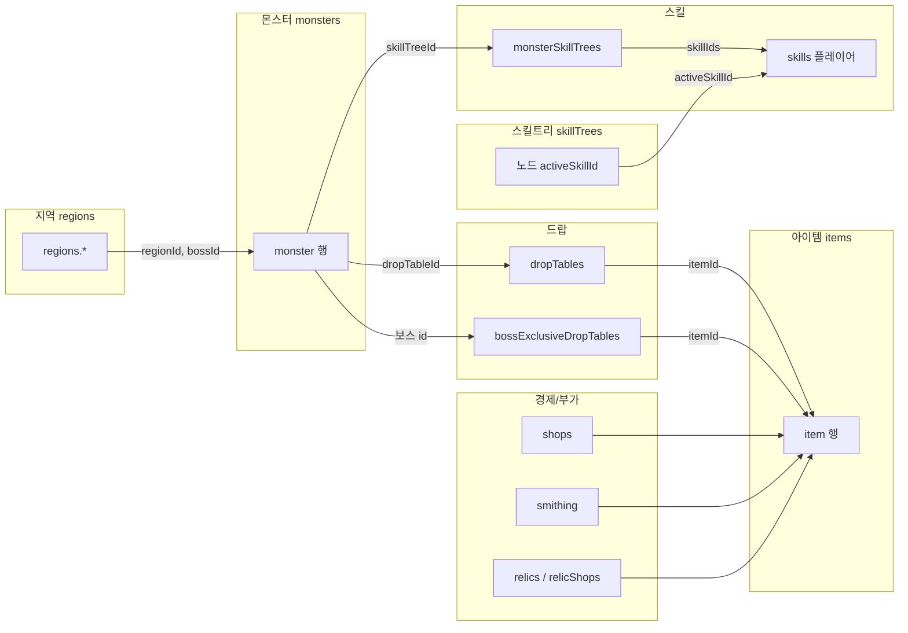

# 데이터 모델 부록 14 — 도메인 의존성

`implementation_plan_14.md` Phase 0 산출물. 편집 시 **참조 방향**을 빠르게 확인하기 위한 문서이다.

## 참조 관계 (요약)

## ID 종류 (용어)

| ID 접두/종류 | 예 | 비고 |
|--------------|-----|------|
| 지역 | `pishon`, `gihon`, … | `monsters.regionId`, `regions.id` |
| 몬스터 | `gray_slime`, `wraith`, … | `dropTableId`는 문자열로 연결 |
| 드랍 테이블 | `drop_f_slime`, … / 보스 키는 보스 id | `bossExclusiveDropTables[bossId]` |
| 아이템 | `gray_dust`, `iron_sword`, … | 장비는 `slot` + `stats` |
| 플레이어 스킬 | `smite`, `meditation`, … | 스킬트리 노드가 참조 |
| 몬스터 스킬 풀 | `st_stick_only`, … | 몬스터 `skillTreeId` |

## 검증 시 우선순위 (권장)

1. `items` 키 존재 (드랍·상점·제련이 참조)
2. `regions` ↔ `monsters.regionId` / `bossId`
3. `monsters.dropTableId` ↔ `dropTables` 또는 보스 전용 규칙
4. `skillTrees`의 `activeSkillId` ↔ `skills`
5. `monsterSkillTrees` 풀의 skill id ↔ `skills`

---

## 구현 반영 (implementation_plan_14)

- **`GAME_DATA.meta`**: `js/data/constants.js`가 `window.GAME_DATA_META`로 등록하고, `data.js` 종료 시 `GAME_DATA.meta`에 병합(폴백 포함).
- **`items.kind`**: `material` | `equipment`. 장비만 `slot` + `stats`.
- **`regions`**: 필드 의도 등급 `fieldGradeMin` / `fieldGradeMax`, UI·밸런스용 `recommendedPlayerLv`, `enemyPowerTier`.
- **검증**: `node scripts/validate-game-data.mjs`
