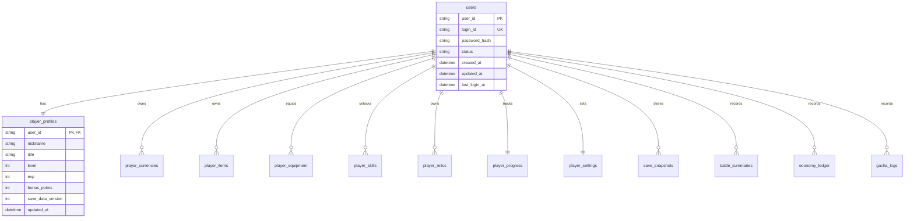

# 데이터 모델 15 — 서버 저장 스키마 초안 (T10-01)

`Docs/tasks/task_10.md`의 **T10-01 (서버 저장 스키마 설계)** 산출물 초안이다.  
목표는 클라이언트 로컬 상태를 서버 저장 구조로 안전하게 이관할 수 있는 최소 모델을 정의하는 것이다.

---

## 1. 설계 원칙

- **서버 권한 우선**: 재화/보상/강화 결과는 서버 검증 후 반영
- **버전 이행 가능**: `saveDataVersion` 기반 마이그레이션 지원
- **이벤트 추적 가능**: 재화/아이템 변경은 이유(`reason`)와 함께 기록
- **확장성 우선**: 전투 로그 상세는 별도 이벤트 테이블로 분리

---

## 2. ERD (요약)

---

## 3. 테이블 상세

## 3.1 `users`

계정/인증 기본 테이블.

| 컬럼 | 타입 | 제약 | 설명 |
|---|---|---|---|
| `user_id` | UUID/String | PK | 내부 유저 식별자 |
| `login_id` | String | UNIQUE, NOT NULL | 로그인 아이디 |
| `password_hash` | String | NOT NULL | 해시된 비밀번호 |
| `status` | Enum | NOT NULL | `active`, `suspended`, `deleted` |
| `created_at` | DateTime | NOT NULL | 생성 시간 |
| `updated_at` | DateTime | NOT NULL | 수정 시간 |
| `last_login_at` | DateTime | NULL | 마지막 로그인 |

## 3.2 `player_profiles`

캐릭터 기본 프로필 + 버전 정보.

| 컬럼 | 타입 | 제약 | 설명 |
|---|---|---|---|
| `user_id` | FK | PK | `users.user_id` |
| `nickname` | String | NOT NULL | 캐릭터 이름 |
| `title` | String | NOT NULL | 칭호 |
| `level` | Int | NOT NULL | 레벨 |
| `exp` | Int | NOT NULL | 경험치 |
| `bonus_points` | Int | NOT NULL | 잔여 포인트 |
| `save_data_version` | Int | NOT NULL | 세이브 버전 |
| `updated_at` | DateTime | NOT NULL | 갱신 시간 |

## 3.3 `player_currencies`

재화 보유량.

| 컬럼 | 타입 | 제약 | 설명 |
|---|---|---|---|
| `user_id` | FK | PK(복합) | 유저 |
| `currency_type` | Enum | PK(복합) | `gold`, `talent` |
| `amount` | Decimal(18,4) | NOT NULL | 현재 보유량 |
| `updated_at` | DateTime | NOT NULL | 갱신 시간 |

> `talent`는 소수점 단위가 있으므로 Decimal 사용.

## 3.4 `player_items`

가방 아이템 수량.

| 컬럼 | 타입 | 제약 | 설명 |
|---|---|---|---|
| `user_id` | FK | PK(복합) | 유저 |
| `item_id` | String | PK(복합) | `GAME_DATA.items` 키 |
| `count` | Int | NOT NULL | 보유 수량 |
| `updated_at` | DateTime | NOT NULL | 갱신 시간 |

## 3.5 `player_equipment`

장착 상태.

| 컬럼 | 타입 | 제약 | 설명 |
|---|---|---|---|
| `user_id` | FK | PK(복합) | 유저 |
| `slot` | Enum | PK(복합) | `weapon`, `armor`, ... |
| `item_id` | String | NULL | 장착 아이템 |
| `updated_at` | DateTime | NOT NULL | 갱신 시간 |

## 3.6 `player_skills`

스킬/트리 해금 상태.

| 컬럼 | 타입 | 제약 | 설명 |
|---|---|---|---|
| `user_id` | FK | PK(복합) | 유저 |
| `skill_tree_id` | String | PK(복합) | 트리 ID |
| `node_id` | String | PK(복합) | 노드 ID |
| `unlocked` | Bool | NOT NULL | 해금 여부 |
| `updated_at` | DateTime | NOT NULL | 갱신 시간 |

## 3.7 `player_relics`

성물 보유/장착/레벨.

| 컬럼 | 타입 | 제약 | 설명 |
|---|---|---|---|
| `user_id` | FK | PK(복합) | 유저 |
| `relic_id` | String | PK(복합) | 성물 ID |
| `level` | Int | NOT NULL | 중복 강화 레벨 |
| `is_equipped` | Bool | NOT NULL | 장착 여부 |
| `updated_at` | DateTime | NOT NULL | 갱신 시간 |

제약:

- `is_equipped = true`는 유저당 최대 1개

## 3.8 `player_progress`

지역/탐험 진행도.

| 컬럼 | 타입 | 제약 | 설명 |
|---|---|---|---|
| `user_id` | FK | PK | 유저 |
| `current_region_id` | String | NOT NULL | 현재 지역 |
| `quest_progress` | Decimal(5,2) | NOT NULL | 현재 지역 진행률 |
| `highest_region_id` | String | NULL | 최고 도달 지역 |
| `updated_at` | DateTime | NOT NULL | 갱신 시간 |

## 3.9 `player_settings`

유저 설정/선택값.

| 컬럼 | 타입 | 제약 | 설명 |
|---|---|---|---|
| `user_id` | FK | PK | 유저 |
| `avatar_id` | String | NULL | 선택 아바타 |
| `auto_explore` | Bool | NOT NULL | 자동 탐험 |
| `auto_battle` | Bool | NOT NULL | 자동 전투 |
| `updated_at` | DateTime | NOT NULL | 갱신 시간 |

## 3.10 `save_snapshots`

복구용 스냅샷.

| 컬럼 | 타입 | 제약 | 설명 |
|---|---|---|---|
| `snapshot_id` | UUID/String | PK | 스냅샷 ID |
| `user_id` | FK | INDEX | 유저 |
| `save_data_version` | Int | NOT NULL | 저장 버전 |
| `payload_json` | JSON | NOT NULL | 직렬화 상태 |
| `created_at` | DateTime | NOT NULL | 생성 시간 |

---

## 4. 운영 로그 테이블 (핵심)

## 4.1 `economy_ledger`

재화/아이템 증감 원장.

| 컬럼 | 타입 | 설명 |
|---|---|---|
| `ledger_id` | UUID/String PK | 원장 ID |
| `user_id` | FK | 유저 |
| `resource_type` | Enum | `currency`, `item` |
| `resource_id` | String | `gold`, `talent`, `item_id` |
| `delta` | Decimal | 변화량 |
| `before_value` | Decimal | 변경 전 |
| `after_value` | Decimal | 변경 후 |
| `reason` | String | 원인 (`battle_reward`, `shop_buy`, `gacha`, ...) |
| `ref_event_id` | String | 연관 이벤트 ID |
| `created_at` | DateTime | 생성 시각 |

## 4.2 `battle_summaries`

전투 요약 로그.

| 컬럼 | 타입 | 설명 |
|---|---|---|
| `battle_id` | UUID/String PK | 전투 ID |
| `user_id` | FK | 유저 |
| `battle_type` | Enum | `field`, `boss`, `dungeon` |
| `enemy_id` | String | 적 ID |
| `enemy_tier` | Int | 적 티어 |
| `turn_count` | Int | 턴 수 |
| `result` | Enum | `win`, `lose`, `escape` |
| `damage_dealt_total` | Int | 총 가한 피해 |
| `damage_taken_total` | Int | 총 받은 피해 |
| `reward_gold` | Int | 획득 골드 |
| `reward_talent` | Decimal(10,4) | 획득 달란트 |
| `created_at` | DateTime | 생성 시각 |

## 4.3 `gacha_logs`

성물 가챠 이력.

| 컬럼 | 타입 | 설명 |
|---|---|---|
| `gacha_event_id` | UUID/String PK | 이벤트 ID |
| `user_id` | FK | 유저 |
| `mode` | Enum | `normal`, `premium` |
| `pull_count` | Int | 뽑기 횟수 |
| `cost_gold` | Int | 골드 소모 |
| `cost_talent` | Decimal(10,4) | 달란트 소모 |
| `result_json` | JSON | 획득 결과 목록 |
| `pity_before` | Int | 천장 카운트 전 |
| `pity_after` | Int | 천장 카운트 후 |
| `created_at` | DateTime | 생성 시각 |

---

## 5. API 저장 단위 제안

- `POST /api/v1/save`
  - 입력: `profile`, `currencies`, `inventory`, `equipment`, `progress`, `relics`, `settings`, `saveDataVersion`
  - 동작: 트랜잭션 단위 업서트 + 스냅샷 저장(옵션)

- `GET /api/v1/save`
  - 출력: 저장 상태 전체 + `saveDataVersion`

- `POST /api/v1/save/migrate`
  - 입력: 구버전 payload
  - 출력: 최신 버전 payload + 적용된 마이그레이션 목록

---

## 6. 무결성/인덱스 규칙

- 재화는 음수 저장 금지 (`amount >= 0`)
- 아이템 수량 음수 금지 (`count >= 0`)
- 장착 아이템은 실제 보유 아이템이어야 함
- `player_relics.is_equipped` 유저당 단일 true
- 필수 인덱스:
  - `economy_ledger(user_id, created_at desc)`
  - `battle_summaries(user_id, created_at desc)`
  - `gacha_logs(user_id, created_at desc)`

---

## 7. 마이그레이션 정책

- `saveDataVersion` 기준으로 순차 마이그레이션 적용
- 변환 함수 네이밍: `migrate_v{N}_to_v{N+1}`
- 실패 시 원본 payload 보존 + 에러 코드 반환
- 메이저 변경은 스냅샷 백업 후 적용

---

## 8. 다음 액션

1. 본 초안 기준으로 실제 DB 엔진(PostgreSQL 등) 타입 확정
2. `T10-02` 저장/로드 API 계약서(`OpenAPI`) 작성
3. `T10-04` 공통 로그 필드와 테이블 매핑 구현 시작

---

## 변경 이력

- **1판**: 서버 저장 스키마 초안 작성 (T10-01).

